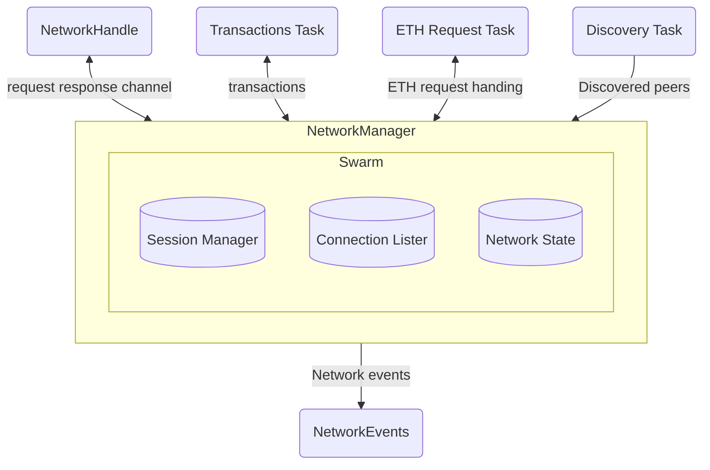

# Aquamarine Bug repro:

1. This graph renders on meraid.live:
https://mermaid.live/edit\#pako:eNptUrFugzAQ_ZWTJyIlQ9sNVR3SRMrQdghs0OGKrwElGGqbRFHIv9fGdkoqWHx3757f-R4XVjScWMxgJ7EtIV3mAgBKFPxA0QfpUyP3myGbDQgdSWgVkPWQOURLFAoLXTVCRekogRTV3rN1KemnI6WjdbqBrYtHDbxSRXMkeY5WIRqhqvtyY3r5dxS4IzlglitpUIS3rS_dCMkJZe2L973-xe5bPmRRQkpZwF8--xzjj1n02ggRdCql_3c8ZWE5kGjUdENJcBv5w20YnheLF-j9TkCSas3CCAoDCzr0Ew-9r8DAD4LOnN6ftntsihcbl6YE_jzyBOtUqNixK7Gb4t2sczMF_4hDSyQnpNic1SRrrLj5_y72ipzpkmrKWWxCjnKfs1xcTR92uknOomCxlh3NWddys9pVhcbdmsXfeFB0_QXgHPTo

2. Doing `cargo doc --open` using aquamarine gives a Syntax Error in Graph because aquamarine uses an older version

https://mermaid.live/edit\#pako:eNptUrFugzAQ_ZWTJyIlQ9sNVR3SRMrQdghs0OGKrwElGGqbRFHIv9fGdkoqWHx3757f-R4XVjScWMxgJ7EtIV3mAgBKFPxA0QfpUyP3myGbDQgdSWgVkPWQOURLFAoLXTVCRekogRTV3rN1KemnI6WjdbqBrYtHDbxSRXMkeY5WIRqhqvtyY3r5dxS4IzlglitpUIS3rS_dCMkJZe2L973-xe5bPmRRQkpZwF8--xzjj1n02ggRdCql_3c8ZWE5kGjUdENJcBv5w20YnheLF-j9TkCSas3CCAoDCzr0Ew-9r8DAD4LOnN6ftntsihcbl6YE_jzyBOtUqNixK7Gb4t2sczMF_4hDSyQnpNic1SRrrLj5_y72ipzpkmrKWWxCjnKfs1xcTR92uknOomCxlh3NWddys9pVhcbdmsXfeFB0_QXgHPTo

